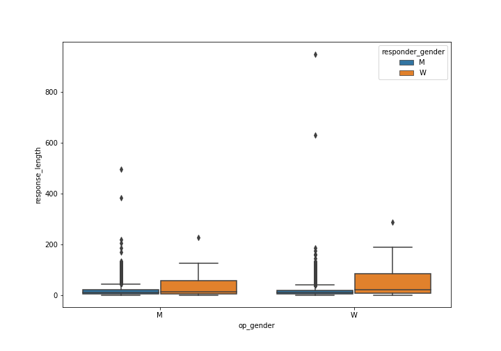
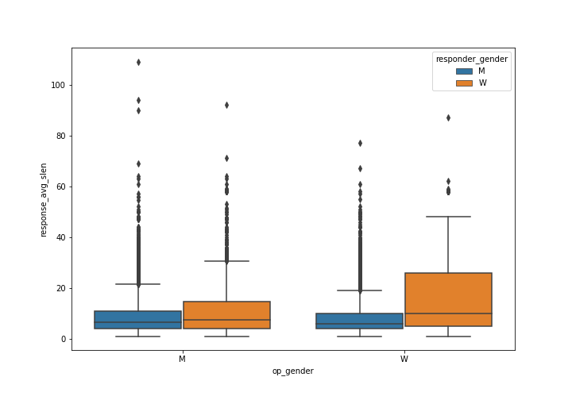
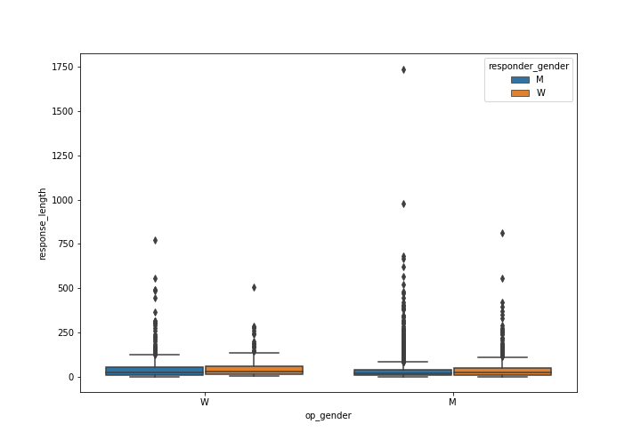
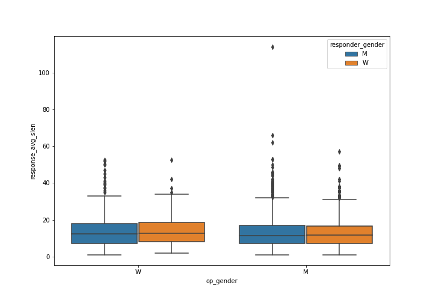
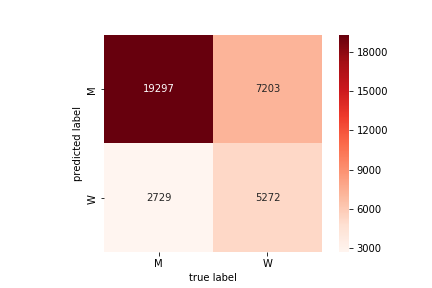

# Gendered Interaction Online: Final Report
Katie Thomas  
kdt13@pitt.edu

## Motivation and Background Information
How do men and women present themselves differently online? Do people respond differently to male vs. female posters? Do male/female responders respond differently depending on the gender they are responding to? These are some initial questions I had when thinking about this project. After reading up on some sociolinguistic literature (*Women, Men, and Language*, by Jennifer Coates). I came up with a few ideas of what to look at. Some notable differences that were discussed were hedges, compliments, and questions. It is thought that women use more hedges, i.e., phrases that express uncertainty, than men, which is possibly due to the fact that they are socialized to believe asserting themselves isn't "ladylike." Also, women tend to give and receive more compliments than men. Additionally, women tend to use more questions that "avoid the role of expert" (i.e., isn't it? don't you? etc.) than men.

## Data
I found my original data from a study done at Stanford University, called [RtGender](https://nlp.stanford.edu/robvoigt/rtgender/). At the bottom of the linked page, you can download the data yourself as long as you sign and agree to use the data for non-commercial research purposes only. This data includes csv files of posts and their corresponding responses from Facebook, TED, Fitocracy, and Reddit.

### Data Cleanup
My goal for the cleanup was to combine the information about the posts into the information about the responses - keeping each individual source separate, as they had slightly different formats. Thus, the cleanup process was somewhat lengthy as I had to examine the best way to merge each file.

#### Facebook Congress
These files were from Facebook, comprised of posts from members of Congress, as well as responses to these posts. The gender is visible for the poster, but not for the responder. Many posts had many responses. I merged on the column called "post_id", as I discovered it was unique to the post in both post and response files. I also filled the nulls with empty strings, since there could be some other worthwhile information in the same row. There also arose an interesting problem, when I realized that sometimes there were duplicate post text values, that were basically the same post by the same person but assigned to a different post ID. I did my best to remove these, making sure that they weren't removed if there was a response attached to it or if they were the first occurrence of the duplicate.

#### Facebook Wiki
Facebook Wiki files were composed of Facebook posts as well, except this time there was a wider range of industries represented (taken from Wikipedia category pages, like "male tennis players"). The gender is again only visible for the poster. These files were formatted in the same manner as the Facebook Congress files, so I faced some of the same challenges. Again, I merged on post ID and filled nulls with empty strings. Additionally, there were also some strange duplicate values of post text that I deleted in the same manner.

#### Fitocracy
Fitocracy is a fitness social media page, where people can discuss fitness, progress, etc. This time, genders were always visible (for both poster and responder!) and there was only one response per post. I again merged on post ID, as it was unique to the post. There were some duplicates that seemed like automated posts ("Welcome to Fitocracy group!"), but the corresponding responses seemed to be unique, so I didn't get rid of duplicate posts this time.

#### Reddit
These files were composed of Reddit posts and responses from a variety of subreddits. Again, there was only one response per post. However, a difference in this file was that the responder's gender was only known sometimes. I could again merge on post ID, and had to fill a few nulls. The duplicates in this case seemed relatively normal, so I again did not get rid of duplicate posts.

#### TED
This file only contains responses, as it was taken from responses to TED talks. Since these are videos, there was no post text. This time, the gender of the speaker was known, but not the gender of the responder. There were a few nulls to fix, as well as some formatting errors, but this time there was no merging necessary.

## Hypothesis
Coates' litearture allowed me to formulate a more specific hypothesis regarding my data:

1. Responders "favor" their own gender. I was unsure of the specifics of this, since it's very vague, but I thought there would be a notable difference in how female responders responded to other females vs. males, and in how male responders responded to other males vs. females.
2. Women use more hedges than men
3. Women use more questions that "avoid the role of expert" than men.

I also would have liked to hypothesize about women giving and receiving more compliments, but this seemed more difficult to analyze. For example, one way that I could think of analyzing this is to physically annotate occurrences of compliments, and then examine what genders and giving and receiving these compliments. This would take a very long time though, and I didn't get into it for my analysis.

## Analysis

### Overview
I started with some basic analysis (located [here](https://nbviewer.jupyter.org/github/Data-Science-for-Linguists-2019/Gendered-Interaction-Online/blob/master/main_analysis.ipynb#Conduct-basic-analysis)) of each file so I could better understand what I was working with. One important thing to note is the gender distributions, as this is very important to my analysis. Fitocracy was the only file that this was close to being an equal distribution. Facebook Congress, Reddit, and TED were very male dominated, whereas Facebook Wiki was more female dominated.

Something interesting to note is how male-dominated Reddit actually is. Out of 98 subreddits, only five (BigBrother, awww, counting, relationships, and rupaulsdragrace) had more female posters than male posters. Below is a graph of the first 20 subreddits to get an idea of how many more male posters there are (look at AskMen and AskReddit especially!).

### Linguistic Analysis by Gender
I then moved onto some linguistic analysis, located [here](https://nbviewer.jupyter.org/github/Data-Science-for-Linguists-2019/Gendered-Interaction-Online/blob/master/main_analysis.ipynb#Conduct-linguistic-analysis). This is again broken up into the separate data source files. However, before conducting analysis, I reduced the sizes of the files down to 50,000, as some of them were huge and would take a very large amount of time to do something like word tokenization. For my linguistic analysis, I calculated text length, average sentence length, and average Google k-band. I also used t-tests to determine the significance of these differences by gender.

The analysis of the TED file was never significant, so I'm not going to discuss it here. However, overall, it seems that female posters and responders had longer posts/responses, as well as longer sentences. This was especially prominent in Facebook Congress, Fitocracy, and Reddit. Facebook Wiki was opposite (male posters had longer posts and sentences) and TED was not significant. Also, in Fitocracy and Reddit, the responses to female posters were longer than responses to male posters.

For hedges and questions (analysis starting [here](https://nbviewer.jupyter.org/github/Data-Science-for-Linguists-2019/Gendered-Interaction-Online/blob/master/main_analysis.ipynb#Linguistic-difference-in-gender)), I created functions to search for them in the text. For hedges, I searched for "I think", "I guess", "I mean", "kind of", "I'm sure", "you know", "sort of", "perhaps", and "maybe". This is of course not an exhaustive list, but these are some common ones that people use. When conducting the analysis, female posters/responders seem to dominate once again, but it's less prominent. Female posters use more hedges in Facebook Congress and Reddit, and female responders use more hedges in Reddit as well. Male posters only use more hedges in Facebook Wiki, and there was no significance for Fitocracy. Unfortunately, there was no signficance for questions in any of the files. The questions I included were "do you?", "don't you?", "aren't there?", and "isn't it?". Some p-values seemed to be low enough, but the questions were present so infrequently (less than 0.1%!) that I made the decision to not count any of them as significant. To more formally do this, annotation would again make more sense.

### Gender x Gender Analysis
An important question to ask is whether the poster's gender is visible to the responder, as that is necessary for this analysis. For the two Facebook files, since the posts are from known people, the gender is known and available to the responders. For Fitocracy, I examined the setup of the website, and discovered that the gender is visible on the person's profile. This could be potentially problematic (since it isn't directly visible on the post), but many users also have pictures of themselves so gender can be inferred from the pictures, as well as clicking on the user's profile. For Reddit, I made sure to filter for "op_gender_visible," meaning the responder is able to see the poster's gender.

#### Fitocracy
Response length

Response sentence length

#### Reddit
Response length

Response sentence length

### Machine Learning
Predict gender

Predict both genders

Predict poster's gender

## Conclusion

